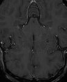
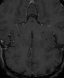
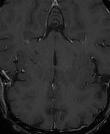
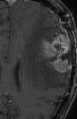
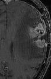
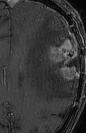
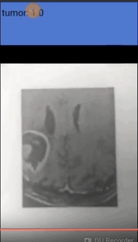
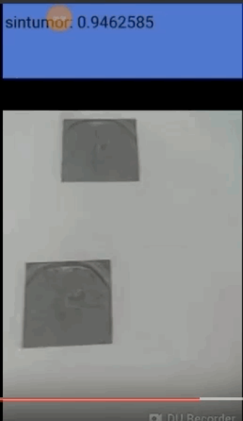

# Aplicación movil (Android Camera Demo) implementada con TensorFlow  para detectar tumores cerebrales 

Este código es una aplicacion movil implementada para Android la cual utiliza redes neuronales convolucionales y permite la detección de tumores en imagenes médicas de cerebro. 

## Descripción

Link donde se saca la aplicación móvil que corre en Android:
https://www.tensorflow.org/mobile/android_build

Reentrenamiento de la Red Neuronal Convolucional 

https://codelabs.developers.google.com/codelabs/tensorflow-for-poets-2/#0

Toda la informacion referente al codigo se encuentra en: (https://github.com/tensorflow/tensorflow):

A partir de la información dada por el sitio anterior se entreno la red neuronal convolucional: MobilNet, con la siguiente información: 

Una base de datos de:
492 imagenes sin tumor cerebral.
Ejemplos de imagenes de entrenamiento:

395 imagenes con turmo cerebral.

Ejemplos de imagenes de entrenamiento:

Para descargar la base de datos: https://drive.google.com/file/d/1tEYDnX66JyDOcGrvAsZ-wvC0c2VnNW-X/view?usp=sharing

## Resultados del entrenamiento 

INFO:tensorflow:2018-09-12 20:47:38.267789: Step 1970: Train accuracy = 100.0%

INFO:tensorflow:2018-09-12 20:47:38.267983: Step 1970: Cross entropy = 0.037101

INFO:tensorflow:2018-09-12 20:47:38.320407: Step 1970: Validation accuracy = 94.0% (N=100)

INFO:tensorflow:2018-09-12 20:47:38.849757: Step 1980: Train accuracy = 100.0%

INFO:tensorflow:2018-09-12 20:47:38.849973: Step 1980: Cross entropy = 0.031685

INFO:tensorflow:2018-09-12 20:47:38.908055: Step 1980: Validation accuracy = 97.0% (N=100)

INFO:tensorflow:2018-09-12 20:47:39.438405: Step 1990: Train accuracy = 98.0%

INFO:tensorflow:2018-09-12 20:47:39.438596: Step 1990: Cross entropy = 0.058183

INFO:tensorflow:2018-09-12 20:47:39.493603: Step 1990: Validation accuracy = 99.0% (N=100)

INFO:tensorflow:2018-09-12 20:47:39.971811: Step 1999: Train accuracy = 99.0%

INFO:tensorflow:2018-09-12 20:47:39.972008: Step 1999: Cross entropy = 0.023113

INFO:tensorflow:2018-09-12 20:47:40.027580: Step 1999: Validation accuracy = 98.0% (N=100)

INFO:tensorflow:Final test accuracy = 97.1% (N=206)

1. [TF Classify](https://github.com/tensorflow/tensorflow/blob/master/tensorflow/examples/android/src/org/tensorflow/demo/ClassifierActivity.java):
        Uses the [Google Inception](https://arxiv.org/abs/1409.4842)
        model to classify camera frames in real-time, displaying the top results
        in an overlay on the camera image.

Resultados:

Mayor información:
luis.santamariac12@gmail.com

A device running Android 5.0 (API 21) or higher is required to run the demo due
to the use of the camera2 API, although the native libraries themselves can run
on API >= 14 devices.
