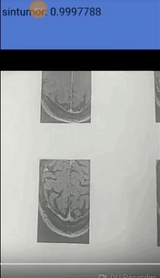

# Aplicación movil (Android Camera Demo) implementada con TensorFlow  para detectar tumores cerebrales 

Este código es una aplicacion movil implementada para Android la cual utiliza redes neuronales convolucionales y permite la detección de tumores en imagenes médicas de cerebro. 

## Descripción

Link donde se saca la aplicación móvil que corre en Android:
https://www.tensorflow.org/mobile/android_build

Reentrenamiento de la Red Neuronal Convolucional 

https://codelabs.developers.google.com/codelabs/tensorflow-for-poets-2/#0

Toda la informacion referente al codigo se encuentra en: (https://github.com/tensorflow/tensorflow):

A partir de la información dada por el sitio anterior se entreno la red neuronal convolucional: MobilNet, con la siguiente información: 

Una base de datos de:
492 imagenes sin tumor cerebral.
395 imagenes con turmo cerebral.

A device running Android 5.0 (API 21) or higher is required to run the demo due
to the use of the camera2 API, although the native libraries themselves can run
on API >= 14 devices.

## Resultados del entrenamiento 

INFO:tensorflow:2018-09-12 20:47:38.267789: Step 1970: Train accuracy = 100.0%
INFO:tensorflow:2018-09-12 20:47:38.267983: Step 1970: Cross entropy = 0.037101
INFO:tensorflow:2018-09-12 20:47:38.320407: Step 1970: Validation accuracy = 94.0% (N=100)
INFO:tensorflow:2018-09-12 20:47:38.849757: Step 1980: Train accuracy = 100.0%
INFO:tensorflow:2018-09-12 20:47:38.849973: Step 1980: Cross entropy = 0.031685
INFO:tensorflow:2018-09-12 20:47:38.908055: Step 1980: Validation accuracy = 97.0% (N=100)
INFO:tensorflow:2018-09-12 20:47:39.438405: Step 1990: Train accuracy = 98.0%
INFO:tensorflow:2018-09-12 20:47:39.438596: Step 1990: Cross entropy = 0.058183
INFO:tensorflow:2018-09-12 20:47:39.493603: Step 1990: Validation accuracy = 99.0% (N=100)
INFO:tensorflow:2018-09-12 20:47:39.971811: Step 1999: Train accuracy = 99.0%
INFO:tensorflow:2018-09-12 20:47:39.972008: Step 1999: Cross entropy = 0.023113
INFO:tensorflow:2018-09-12 20:47:40.027580: Step 1999: Validation accuracy = 98.0% (N=100)
INFO:tensorflow:Final test accuracy = 97.1% (N=206)

1. [TF Classify](https://github.com/tensorflow/tensorflow/blob/master/tensorflow/examples/android/src/org/tensorflow/demo/ClassifierActivity.java):
        Uses the [Google Inception](https://arxiv.org/abs/1409.4842)
        model to classify camera frames in real-time, displaying the top results
        in an overlay on the camera image.

### Android Studio

Android Studio may be used to build the demo in conjunction with Bazel. First,
make sure that you can build with Bazel following the above directions. Then,
look at [build.gradle](build.gradle) and make sure that the path to Bazel
matches that of your system.

At this point you can add the tensorflow/examples/android directory as a new
Android Studio project. Click through installing all the Gradle extensions it
requests, and you should be able to have Android Studio build the demo like any
other application (it will call out to Bazel to build the native code with the
NDK).

### CMake

Full CMake support for the demo is coming soon, but for now it is possible to
build the TensorFlow Android Inference library using
[tensorflow/contrib/android/cmake](../../../tensorflow/contrib/android/cmake).
